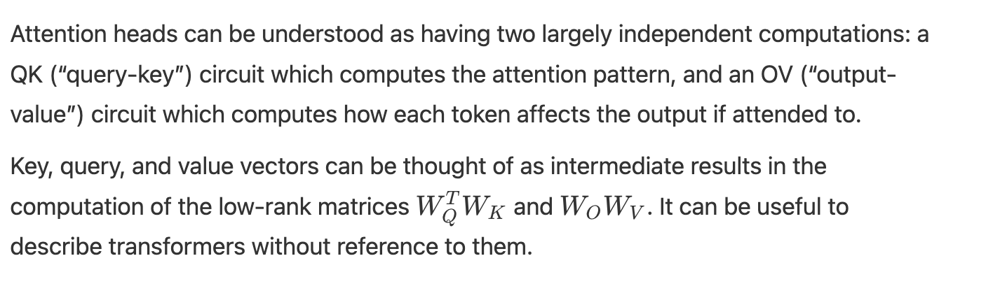
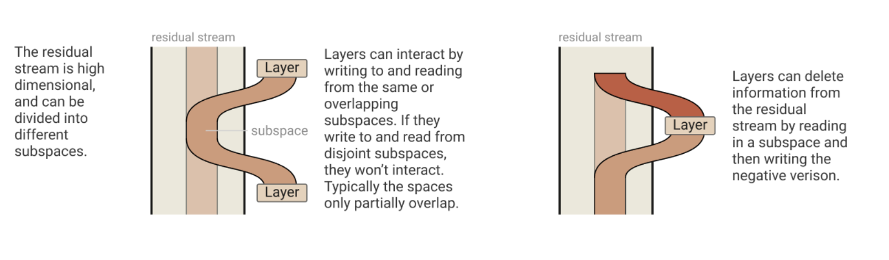
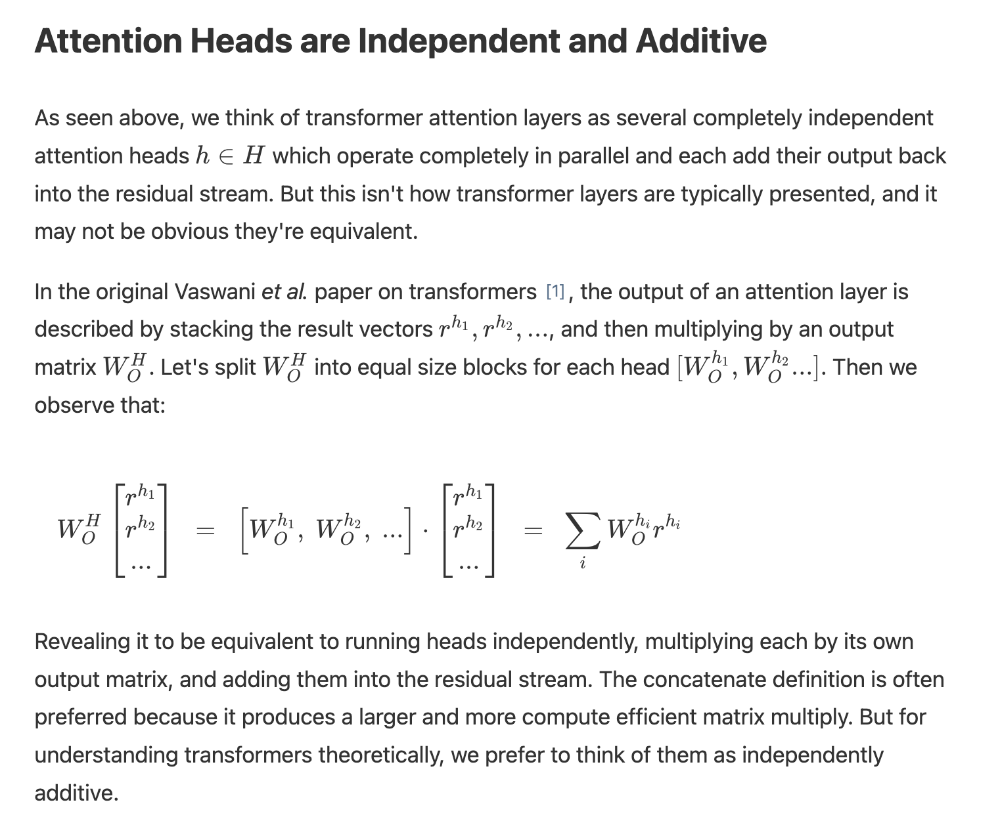
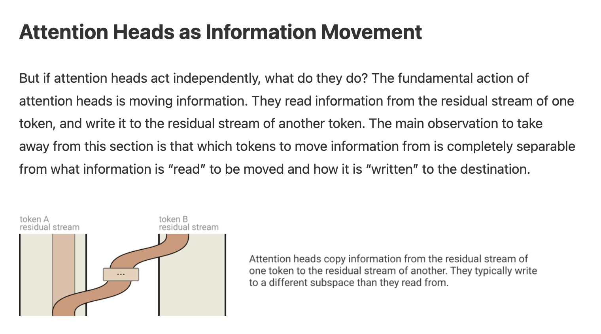
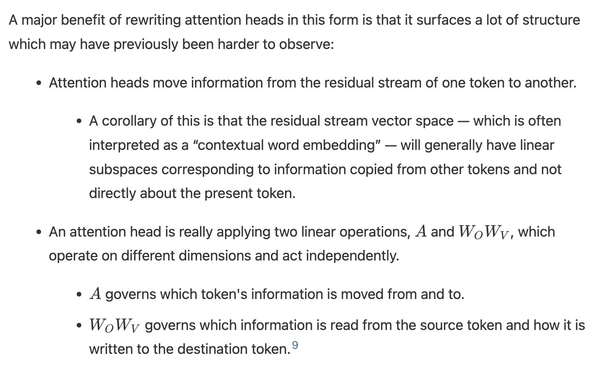
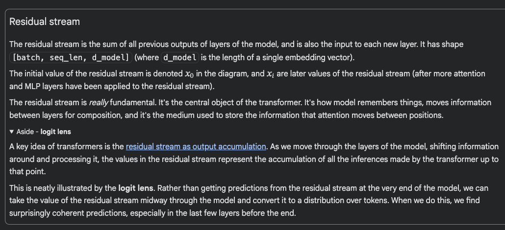

- Mathematical model of Transformers for Mech Interp, by Anthropic: https://transformer-circuits.pub/2021/framework/index.html

Attention heads can be understood as independent operations, each outputting a result which is added into the residual stream. Attention heads are often described in an alternate “concatenate and multiply” formulation for computational efficiency, but this is mathematically equivalent.

Attention-only models can be written as a sum of interpretable end-to-end functions mapping tokens to changes in logits. These functions correspond to “paths” through the model, and are linear if one freezes the attention patterns.

Transformers have an enormous amount of linear structure. One can learn a lot simply by breaking apart sums and multiplying together chains of matrices.

Composition of attention heads greatly increases the expressivity of transformers. There are three different ways attention heads can compose, corresponding to keys, queries, and values. Key and query composition are very different from value composition.

All components of a transformer (the token embedding, attention heads, MLP layers, and unembedding) communicate with each other by reading and writing to different subspaces of the residual stream. Rather than analyze the residual stream vectors, it can be helpful to decompose the residual stream into all these different communication channels, corresponding to paths through the model.

In most parts of this paper, we will make a very substantive change: we focus on “attention-only” transformers, which don't have MLP layers. This is a very dramatic simplification of the transformer architecture. We're partly motivated by the fact that circuits with attention heads present new challenges not faced by the Distill circuits work, and considering them in isolation allows us to give an especially elegant treatment of those issues. But we've also simply had much less success in understanding MLP layers so far; in normal transformers with both attention and MLP layers there are many circuits mediated primarily by attention heads which we can study, some of which seem very important, but the MLP portions have been much harder to get traction on. This is a major weakness of our work that we plan to focus on addressing in the future. Despite this, we will have some discussion of transformers with MLP layers in later sections.

One of the main features of the high level architecture of a transformer is that each layer adds its results into what we call the “residual stream.” 2 The residual stream is simply the sum of the output of all the previous layers and the original embedding. We generally think of the residual stream as a communication channel, since it doesn't do any processing itself and all layers communicate through it.

The residual stream doesn't have a "privileged basis"; we could rotate it by rotating all the matrices interacting with it, without changing model behavior.

> Since we're disconsidering the MLP layer, yes, it makes sense to claim it's all a bunch of linear transforms, because the non-linear activations are on the MLP layers I assume.

An especially useful consequence of the residual stream being linear is that one can think of implicit "virtual weights" directly connecting any pair of layers (even those separated by many other layers), by multiplying out their interactions through the residual stream. These virtual weights are the product of the output weights of one layer with the input weights 5 of another (ie. 
W
I
2
W
O
1
W 
I
2
​
 W 
O
1
​
 ), and describe the extent to which a later layer reads in the information written by a previous layer.

The residual stream is a high-dimensional vector space. In small models, it may be hundreds of dimensions; in large models it can go into the tens of thousands. This means that layers can send different information to different layers by storing it in different subspaces. This is especially important in the case of attention heads, since every individual head operates on comparatively small subspaces (often 64 or 128 dimensions), and can very easily write to completely disjoint subspaces and not interact.

Once added, information persists in a subspace unless another layer actively deletes it. From this perspective, dimensions of the residual stream become something like "memory" or "bandwidth". The original token embeddings, as well as the unembeddings, mostly interact with a relatively small fraction of the dimensions. 6 This leaves most dimensions "free" for other layers to store information in.

It seems like we should expect residual stream bandwidth to be in very high demand! There are generally far more "computational dimensions" (such as neurons and attention head result dimensions) than the residual stream has dimensions to move information. Just a single MLP layer typically has four times more neurons than the residual stream has dimensions. So, for example, at layer 25 of a 50 layer transformer, the residual stream has 100 times more neurons as it has dimensions before it, trying to communicate with 100 times as many neurons as it has dimensions after it, somehow communicating in superposition!

We call tensors like this "bottleneck activations" and expect them to be unusually challenging to interpret. (This is a major reason why we will try to pull apart the different streams of communication happening through the residual stream apart in terms of virtual weights, rather than studying it directly.)

Perhaps because of this high demand on residual stream bandwidth, we've seen hints that some MLP neurons and attention heads may perform a kind of "memory management" role, clearing residual stream dimensions set by other layers by reading in information and writing out the negative version. 7

> Tá, então por enquanto o que tô imaginando é que cada camada lê de um lugar e escreve nele, e a gente está chamando isso de residual stream. Cada camada pode escrever em coisas que outra camada tinha escrito antes (superposição)?

 

Importantly, the MLP operates on positions in the residual stream independently, and in exactly the same way. It doesn't move information between positions.

To go back to our analogy for transformers, we can essentially view MLPs as the thinking that each person in the line does once they've grabbed the information they need from the people behind them (via attention). Usually the MLP layers make up a much larger fraction of the model's total parameter count than attention layers (often around 2/3 although this varies between architectures), which makes sense since processing the information is a bigger task than just moving it around.

A key insight from the Mathematical Frameworks paper is that we should focus on interpreting the parts of the model that are intrinsically interpretable - the input tokens, the output logits and the attention patterns. Everything else (the residual stream, keys, queries, values, etc) are compressed intermediate states when calculating meaningful things. So a natural place to start is classifying heads by their attention patterns on various texts.

